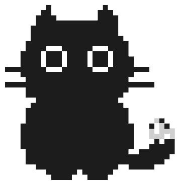

# Pixel Deskpet

<p align="center">
  
</p>

A living, interactive pixel-art cat that sits on your Mac desktop — transparent overlay, click-through everywhere except on its own body, with zero rendering glitches or input conflicts.

🌐 **Live Web Landing Page**: [https://diablovocado.github.io/Pixel-Pet/](https://diablovocado.github.io/Pixel-Pet/)

---

## 🚀 Quick Start

```bash
npm install
npm start
```

> **macOS Accessibility permission** is recommended for real-time keystroke tracking and mechanical keycap typing animations.
> 
> **Setup:** System Settings → Privacy & Security → Accessibility → toggle ON **Pixel Deskpet**.

---

## ✨ Features & Mechanics

### 1. Cursor Pursuit & Running Stride
- **Cursor Chasing**: When your mouse moves further than 45px away, the cat runs towards it with smooth stride math and directional face flipping (`scaleX * faceDir`).
- **Running Stride Bounce**: Dynamic sine-wave stride bounce (`Math.sin(Date.now() * 0.018) * 3`) while running.

### 2. Dock Sleeping & Click-to-Wake
- **Dock Sleeping**: Move your cursor down near the bottom screen Dock (`mouseY >= window.innerHeight - 80`), and the cat settles down near the Dock, emits drifting blue `z Z` sleep particles, and displays `sleep.png`.
- **Persistent Sleep**: While sleeping, cursor pursuit is suppressed. Moving your mouse around the screen will not disturb her.
- **Click-to-Wake**: Hover over her sleeping body and **click** to wake her up (`currentState = 'IDLE'`), restoring normal poses and cursor pursuit!

### 3. Keyboard Typing & WebM Animation
- **WebM Typing Animation**: On real keydown events, the cat switches to the typing state (`tyoe.webm`), seamlessly scaled (`1.38x`) to match the resting cat sprite 1-to-1 without size jumps or pops.
- **Hardware-Level Keystroke Guard**: Uses hardware key identifier filtering (`kVK_ANSI_...`) to strictly separate keyboard typing from trackpad/mouse clicks.

### 4. Interactive Mochi Drag & Petting
- **Mochi Vertical Drag**: Click-and-drag vertically to stretch the cat (`scaleY = 1 + Math.min(dragDistanceY / 100, 0.7); scaleX = 1 / scaleY`).
- **Instant Snap-Back**: Releasing mouse (`mouseup`) instantly snaps proportions back to 1-to-1.
- **Mood Reactions**: Quick clicks spawn floating pink hearts and display pixelated speech bubbles with randomized greetings like `"hi maith! 👋"`, `"meow~ 💕"`, `"let's code! 💻"`, and more.

---

## 🛠 Project Structure

```
Pixel-Pet/
├── main.js                  # Electron entry point & window orchestrator
├── preload.js               # IPC bridge (main ↔ renderer)
├── renderer.js              # Single-canvas animation engine & loop
├── index.html               # Clean HTML DOM skeleton
│
├── assets/
│   ├── cat.png              # Resting cat PNG sprite
│   ├── sleep.png            # Dock sleeping PNG sprite
│   ├── tyoe.webm            # Transparent WebM typing animation
│   ├── tyoe_left.png        # Left keyframe typing frame
│   └── tyoe_right.png       # Right keyframe typing frame
│
└── src/
    └── main/
        ├── keyboard.js      # Global keyboard listener with kVK_ whitelist
        ├── polling.js       # Mouse cursor & system idle polling
        ├── tray.js          # macOS tray menu & options
        └── settings.js      # Persistent user settings
```

---

## ⚙️ Architecture Rules

- **Single HTML5 Canvas**: All rendering (PNG assets, WebM video, speech bubbles, particles) occurs on a single `<canvas id="catCanvas">` element.
- **Pure Image Assets**: Zero procedural shape drawing over cat faces.
- **Single Instance Lock**: Enforced via Electron `app.requestSingleInstanceLock()` to prevent duplicate transparent window processes.

---

*Original project — all art assets and code customized for Pixel-Pet.*
